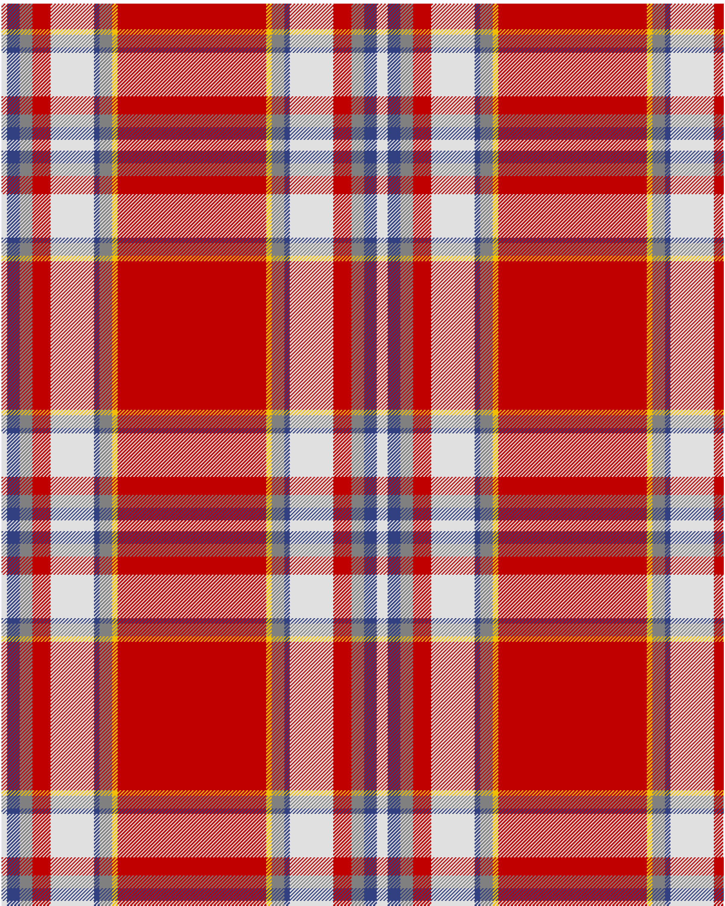

The parent of this is [Drummond of Perth, dress](/tartans/ln/6/b14/n14/r20/ln48/b6/n14/y6/r/82/)

This was sourced from <no value>.  It is a [9 stripes tartan](/stripes/stripes9/).

Original link http://www.weddslist.com/cgi-bin/tartans/pg.pl?source=sts

## Thread count
LN/6 B14 N14 R20 LN48 B6 N14 Y6 R/82

## Palette
B LN N R Y

# Sample pattern

ID: /variants/ln/6/b14/n14/r20/ln48/b6/n14/y6/r/82-b304080-lne0e0e0-n808080-rc00000-yf0c000/