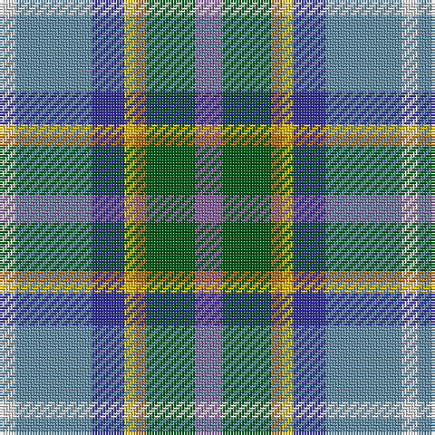

The parent of this is [Manx National (District)](/tartans/ln/6/b28/db12/y4/lt4/g18/lp/10/)

This was sourced from tartans-authority.  It is a [7 stripes tartan](/stripes/stripes7/).

Original link http://www.tartansauthority.com/tartan-ferret/display/185/

## Thread count
LN/6 B28 DB12 Y4 LT4 G18 LP/10

## Palette
Each colour and its ΔE from the base-6 reference it is a variant of.

| Colour | Shade | Base | ΔE (OKLab) |
|---|---|---|---|
| B |  `#608CA4` | B  | 0.24 |
| DB |  `#303094` | B  | 0.05 |
| G |  `#005814` | G  | 0.04 |
| LN |  `#E0E0E0` | W  | 0.06 |
| LP |  `#88609C` | B  | 0.18 |
| LT |  `#A86C1C` | R  | 0.16 |
| Y |  `#E8C000` | Y  | 0.00 |

# Sample pattern

ID: /variants/ln/6/b28/db12/y4/lt4/g18/lp/10-b608ca4-db303094-g005814-lne0e0e0-lp88609c-lta86c1c-ye8c000/
