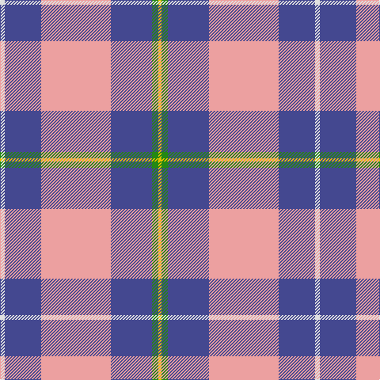

The parent of this is [Tartan Lassie (Fashion)](/tartans/ln/6/b46/lr88/b52/g8/y/4/)

This was sourced from tartans-authority.  It is a [6 stripes tartan](/stripes/stripes6/).

Original link http://www.tartansauthority.com/tartan-ferret/display/7883/

## Thread count
LN/6 B46 LR88 B52 G8 Y/4

## Palette
Each colour and its ΔE from the base-6 reference it is a variant of.

| Colour | Shade | Base | ΔE (OKLab) |
|---|---|---|---|
| B |  `#444890` | B  | 0.05 |
| G |  `#248814` | G  | 0.12 |
| LN |  `#E0E0E0` | W  | 0.06 |
| LR |  `#ECA0A0` | Y  | 0.17 |
| Y |  `#E8C000` | Y  | 0.00 |

# Sample pattern

ID: /variants/ln/6/b46/lr88/b52/g8/y/4-b444890-g248814-lne0e0e0-lreca0a0-ye8c000/
