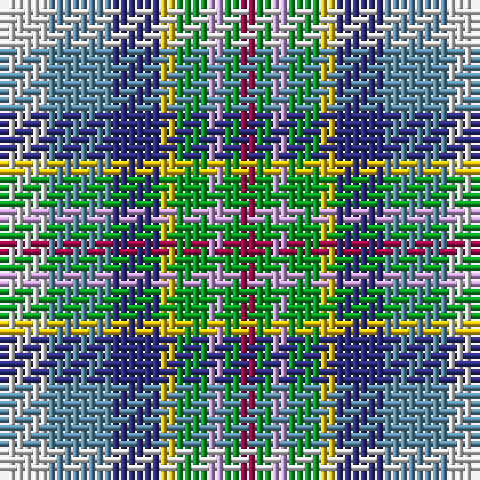

The parent of this is [Queensland (District)](/tartans/ln/6/b8/db6/y2/g4/lp2/g2/r/2/)

This was sourced from tartans-authority.  It is a [8 stripes tartan](/stripes/stripes8/).

Original link http://www.tartansauthority.com/tartan-ferret/display/2618/

## Thread count
LN/6 B8 DB6 Y2 G4 LP2 G2 R/2

## Palette
Each colour and its ΔE from the base-6 reference it is a variant of.

| Colour | Shade | Base | ΔE (OKLab) |
|---|---|---|---|
| B |  `#5C8CA8` | B  | 0.23 |
| DB |  `#2C2C80` | B  | 0.05 |
| G |  `#009C24` | G  | 0.17 |
| LN |  `#E0E0E0` | W  | 0.06 |
| LP |  `#C49CD8` | W  | 0.24 |
| R |  `#A00048` | R  | 0.11 |
| Y |  `#E8C000` | Y  | 0.00 |

# Sample pattern

ID: /variants/ln/6/b8/db6/y2/g4/lp2/g2/r/2-b5c8ca8-db2c2c80-g009c24-lne0e0e0-lpc49cd8-ra00048-ye8c000/
