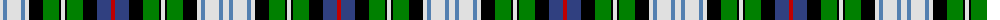

The parent of this is [MacKenzie, dress](/tartans/ln/6/ba4/ln14/ba4/ln4/k14/g16/k2/ln4/k2/g16/k14/b14/r/4/)

This was sourced from weddslist.  It is a [14 stripes tartan](/stripes/stripes14/).

Original link http://www.weddslist.com/cgi-bin/tartans/pg.pl?source=sts

## Thread count
LN/6 Ba4 LN14 Ba4 LN4 K14 G16 K2 LN4 K2 G16 K14 B14 R/4

## Palette
Each colour and its ΔE from the base-6 reference it is a variant of.

| Colour | Shade | Base | ΔE (OKLab) |
|---|---|---|---|
| B |  `#304080` | B  | 0.01 |
| Ba |  `#5480B0` | B  | 0.20 |
| G |  `#008000` | G  | 0.09 |
| K |  `#000000` | K  | 0.00 |
| LN |  `#E0E0E0` | W  | 0.06 |
| R |  `#C00000` | R  | 0.02 |

ID: /variants/ln/6/ba4/ln14/ba4/ln4/k14/g16/k2/ln4/k2/g16/k14/b14/r/4-b304080-ba5480b0-g008000-k000000-lne0e0e0-rc00000/
