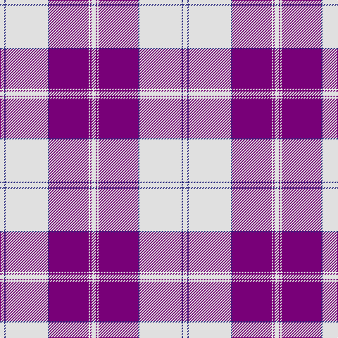

The parent of this is [Dunlop Dress Family Tartan Tartan Number: 1784. Earliest known date: 1984 Revised version See products available Copyright © Blair Urquhart, Comrie, 2015](/tartans/ln/6/db2/ln60/db2/p56/ln2/p2/ln/6/)

This was sourced from house-of-tartan.  It is a [8 stripes tartan](/stripes/stripes8/).

Original link http://www.house-of-tartan.scotland.net/house/TartanViewjs.asp?colr=Def&tnam=1784

## Thread count
LN/6 DB2 LN60 DB2 P56 LN2 P2 LN/6

## Palette
Each colour and its ΔE from the base-6 reference it is a variant of.

| Colour | Shade | Base | ΔE (OKLab) |
|---|---|---|---|
| DB |  `#2C2C80` | B  | 0.05 |
| LN |  `#E0E0E0` | W  | 0.06 |
| P |  `#780078` | B  | 0.16 |

# Sample pattern

ID: /variants/ln/6/db2/ln60/db2/p56/ln2/p2/ln/6-db2c2c80-lne0e0e0-p780078/
