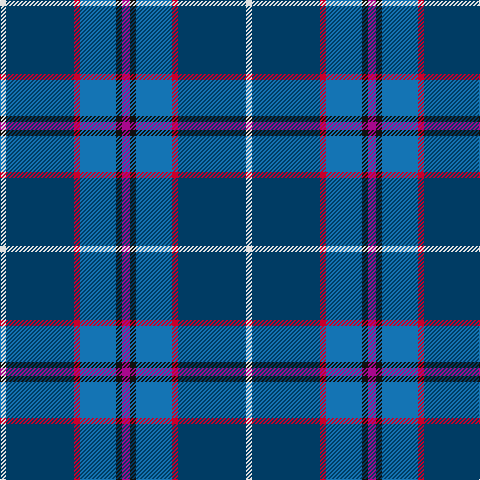

The parent of this is [Margach, William (Personal)](/tartans/ln/6/db68/r6/b36/k6/p/8/)

This was sourced from tartans-authority.  It is a [6 stripes tartan](/stripes/stripes6/).

Original link http://www.tartansauthority.com/tartan-ferret/display/10319/

## Thread count
LN/6 DB68 R6 B36 K6 P/8

## Palette
Each colour and its ΔE from the base-6 reference it is a variant of.

| Colour | Shade | Base | ΔE (OKLab) |
|---|---|---|---|
| B |  `#1474B4` | B  | 0.15 |
| DB |  `#003C64` | B  | 0.07 |
| K |  `#101010` | K  | 0.17 |
| LN |  `#E0E0E0` | W  | 0.06 |
| P |  `#A8088C` | R  | 0.19 |
| R |  `#C8002C` | R  | 0.03 |

# Sample pattern

ID: /variants/ln/6/db68/r6/b36/k6/p/8-b1474b4-db003c64-k101010-lne0e0e0-pa8088c-rc8002c/
