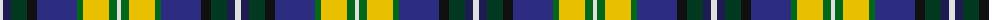

The parent of this is [Armagh County Crest (Fashion)](/tartans/ln/6/dba8/dg16/k10/db40/g6/y26/g8/ln/4/)

This was sourced from tartans-authority.  It is a [9 stripes tartan](/stripes/stripes9/).

Original link http://www.tartansauthority.com/tartan-ferret/display/7447/

## Thread count
LN/6 DBa8 DG16 K10 DB40 G6 Y26 G8 LN/4

## Palette
Each colour and its ΔE from the base-6 reference it is a variant of.

| Colour | Shade | Base | ΔE (OKLab) |
|---|---|---|---|
| DB |  `#2C2C80` | B  | 0.05 |
| DBa |  `#1C1C50` | B  | 0.14 |
| DG |  `#003820` | G  | 0.16 |
| G |  `#006818` | G  | 0.02 |
| K |  `#101010` | K  | 0.17 |
| LN |  `#E0E0E0` | W  | 0.06 |
| Y |  `#E8C000` | Y  | 0.00 |

ID: /variants/ln/6/dba8/dg16/k10/db40/g6/y26/g8/ln/4-db2c2c80-dba1c1c50-dg003820-g006818-k101010-lne0e0e0-ye8c000/
