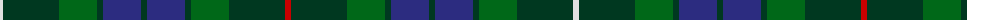

The parent of this is [B.B. Special Corporate Tartan Tartan Number: 1466. Earliest known date: pre 2003 Previously marked 'Unidentified' in STS file. No explanation is given for the title which Paton has named as 'B.B. Special Tartan'. This tartan has recently been woven by MacNaughtons of Pitlochry as the result of a request by a unit of the Boys Brigade. See products available Copyright © Blair Urquhart, Comrie, 2015](/tartans/ln/6/dg56/g38/dg6/db38/dg6/db38/dg6/g38/dg56/r/6/)

This was sourced from house-of-tartan.  It is a [11 stripes tartan](/stripes/stripes11/).

Original link http://www.house-of-tartan.scotland.net/house/TartanViewjs.asp?colr=Def&tnam=1466

## Thread count
LN/6 DG56 G38 DG6 DB38 DG6 DB38 DG6 G38 DG56 R/6

## Palette
Each colour and its ΔE from the base-6 reference it is a variant of.

| Colour | Shade | Base | ΔE (OKLab) |
|---|---|---|---|
| DB |  `#2C2C80` | B  | 0.05 |
| DG |  `#003820` | G  | 0.16 |
| G |  `#006818` | G  | 0.02 |
| LN |  `#E0E0E0` | W  | 0.06 |
| R |  `#C80000` | R  | 0.00 |

ID: /variants/ln/6/dg56/g38/dg6/db38/dg6/db38/dg6/g38/dg56/r/6-db2c2c80-dg003820-g006818-lne0e0e0-rc80000/
