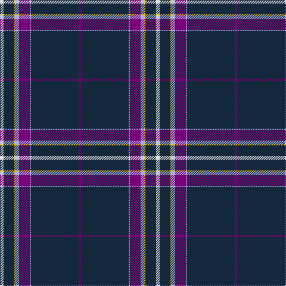

The parent of this is [Parkin (Personal)](/tartans/ln/6/dn18/y2/lp6/p18/lp2/dn80/p/4/)

This was sourced from tartans-authority.  It is a [8 stripes tartan](/stripes/stripes8/).

Original link http://www.tartansauthority.com/tartan-ferret/display/6003/

## Thread count
LN/6 DN18 Y2 LP6 P18 LP2 DN80 P/4

## Palette
Each colour and its ΔE from the base-6 reference it is a variant of.

| Colour | Shade | Base | ΔE (OKLab) |
|---|---|---|---|
| DN |  `#14283C` | B  | 0.14 |
| LN |  `#E0E0E0` | W  | 0.06 |
| LP |  `#A8ACE8` | W  | 0.22 |
| P |  `#780078` | B  | 0.16 |
| Y |  `#E8C000` | Y  | 0.00 |

# Sample pattern

ID: /variants/ln/6/dn18/y2/lp6/p18/lp2/dn80/p/4-dn14283c-lne0e0e0-lpa8ace8-p780078-ye8c000/
