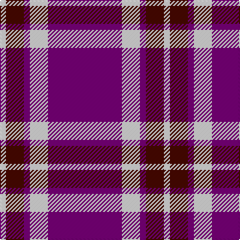

The parent of this is [Glen App Trade Tartan Tartan Number: 636. Earliest known date: pre 2003 A fashion check See products available Copyright © Blair Urquhart, Comrie, 2015](/tartans/ln/6/dr18/p6/ln18/p/74/)

This was sourced from house-of-tartan.  It is a [5 stripes tartan](/stripes/stripes5/).

Original link http://www.house-of-tartan.scotland.net/house/TartanViewjs.asp?colr=Def&tnam=636

## Thread count
LN/6 DR18 P6 LN18 P/74

## Palette
Each colour and its ΔE from the base-6 reference it is a variant of.

| Colour | Shade | Base | ΔE (OKLab) |
|---|---|---|---|
| DR |  `#480800` | B  | 0.23 |
| LN |  `#E0E0E0` | W  | 0.06 |
| P |  `#780078` | B  | 0.16 |

# Sample pattern

ID: /variants/ln/6/dr18/p6/ln18/p/74-dr480800-lne0e0e0-p780078/
