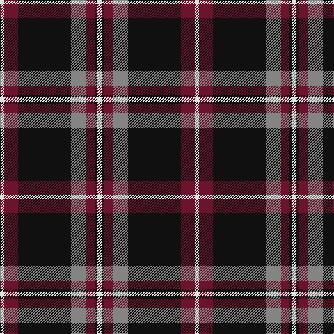

The parent of this is [Phantom (Corporate)](/tartans/ln/6/dr20/k76/n22/dr12/k4/ln/6/)

This was sourced from tartans-authority.  It is a [7 stripes tartan](/stripes/stripes7/).

Original link http://www.tartansauthority.com/tartan-ferret/display/10050/

## Thread count
LN/6 DR20 K76 N22 DR12 K4 LN/6

## Palette
Each colour and its ΔE from the base-6 reference it is a variant of.

| Colour | Shade | Base | ΔE (OKLab) |
|---|---|---|---|
| DR |  `#6C142C` | B  | 0.19 |
| K |  `#101010` | K  | 0.17 |
| LN |  `#E0E0E0` | W  | 0.06 |
| N |  `#848484` | G  | 0.23 |

# Sample pattern

ID: /variants/ln/6/dr20/k76/n22/dr12/k4/ln/6-dr6c142c-k101010-lne0e0e0-n848484/
