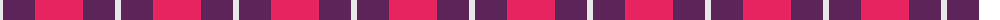
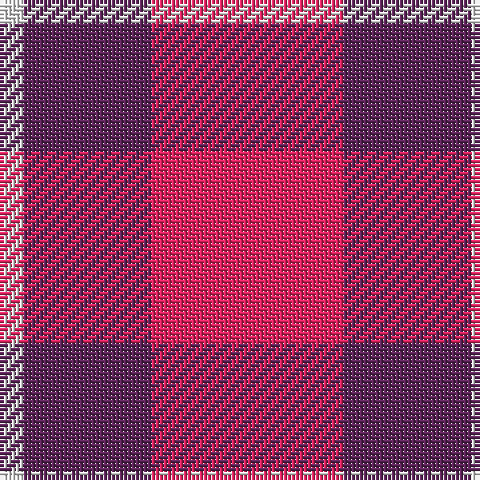

The parent of this is [National Autistic Society Scotla Corporate Tartan Tartan Number: 10685. Earliest known date: 30 August 2012 A simple and bold design using the highly identifiable colours of the National Autistic Society. This tartan is intended for use by the Scottish members of the Society. See products available Copyright © Blair Urquhart, Comrie, 2015](/tartans/ln/6/dr32/r/48/)

This was sourced from house-of-tartan.  It is a [3 stripes tartan](/stripes/stripes3/).

Original link http://www.house-of-tartan.scotland.net/house/TartanViewjs.asp?colr=Def&tnam=10685

## Thread count
LN/6 DR32 R/48

## Palette
Each colour and its ΔE from the base-6 reference it is a variant of.

| Colour | Shade | Base | ΔE (OKLab) |
|---|---|---|---|
| DR |  `#5C2458` | B  | 0.12 |
| LN |  `#E8E8E8` | W  | 0.04 |
| R |  `#E82460` | R  | 0.11 |

# Sample pattern

ID: /variants/ln/6/dr32/r/48-dr5c2458-lne8e8e8-re82460/
