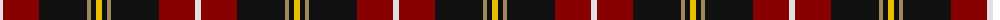

The parent of this is [Drambuie (Corporate)](/tartans/ln/6/dr36/k48/lt4/k5/y/6/)

This was sourced from tartans-authority.  It is a [6 stripes tartan](/stripes/stripes6/).

Original link http://www.tartansauthority.com/tartan-ferret/display/2474/

## Thread count
LN/6 DR36 K48 LT4 K5 Y/6

## Palette
Each colour and its ΔE from the base-6 reference it is a variant of.

| Colour | Shade | Base | ΔE (OKLab) |
|---|---|---|---|
| DR |  `#880000` | R  | 0.14 |
| K |  `#101010` | K  | 0.17 |
| LN |  `#E0E0E0` | W  | 0.06 |
| LT |  `#A08858` | Y  | 0.21 |
| Y |  `#E8C000` | Y  | 0.00 |

# Sample pattern

ID: /variants/ln/6/dr36/k48/lt4/k5/y/6-dr880000-k101010-lne0e0e0-lta08858-ye8c000/
