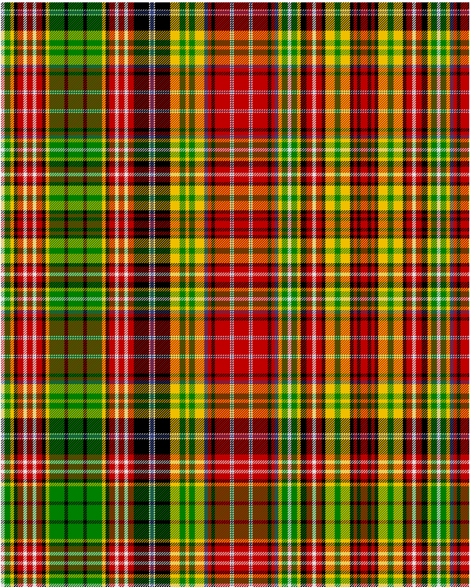

Drummond of Strathallan

Drummond of Strathallan

This was sourced from <no value>.  It is a 65 stripes tartan.

Original link http://www.weddslist.com/cgi-bin/tartans/pg.pl?source=sts

## Thread count
LN/6 G10 Y6 K6 R10 LN6 R10 LN6 R10 K6 Y6 G26 K6 G26 K6 G26 Y6 K6 R10 LN6 R10 LN6 R10 K26 LN2 B6 LN2 K26 Y16 G10 Y6 G10 Y16 B6 R6 K6 R26 LN2 B2 LN2 R26 LN2 B2 LN2 R26 K6 R6 B6 Y6 G10 LN6 G10 Y6 K10 R10 LN6 R10 K6 Y16 G10 Y16 K6 R6 K6 R/6

## Palette
B#304080 G#008000 K#000000 LN#E0E0E0 R#C00000 Y#F0C000

# Sample pattern

ID: /variants/ln/6/g10/y6/k6/r10/ln6/r10/ln6/r10/k6/y6/g26/k6/g26/k6/g26/y6/k6/r10/ln6/r10/ln6/r10/k26/ln2/b6/ln2/k26/y16/g10/y6/g10/y16/b6/r6/k6/r26/ln2/b2/ln2/r26/ln2/b2/ln2/r26/k6/r6/b6/y6/g10/ln6/g10/y6/k10/r10/ln6/r10/k6/y16/g10/y16/k6/r6/k6/r/6-b304080-g008000-k000000-lne0e0e0-rc00000-yf0c000/