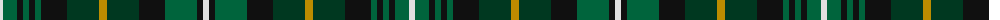

The parent of this is [Terre De'Ecosse (Corporate)](/tartans/ln/6/g14/k6/g6/k6/g6/k26/dg32/dy8/dg32/k26/g32/k6/ln/6/)

This was sourced from tartans-authority.  It is a [14 stripes tartan](/stripes/stripes14/).

Original link http://www.tartansauthority.com/tartan-ferret/display/4037/

## Thread count
LN/6 G14 K6 G6 K6 G6 K26 DG32 DY8 DG32 K26 G32 K6 LN/6

## Palette
Each colour and its ΔE from the base-6 reference it is a variant of.

| Colour | Shade | Base | ΔE (OKLab) |
|---|---|---|---|
| DG |  `#003820` | G  | 0.16 |
| DY |  `#BC8C00` | Y  | 0.16 |
| G |  `#00643C` | G  | 0.06 |
| K |  `#101010` | K  | 0.17 |
| LN |  `#E0E0E0` | W  | 0.06 |

ID: /variants/ln/6/g14/k6/g6/k6/g6/k26/dg32/dy8/dg32/k26/g32/k6/ln/6-dg003820-dybc8c00-g00643c-k101010-lne0e0e0/
