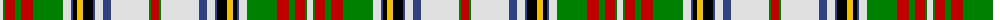

The parent of this is [Victoria](/tartans/ln/6/g2/r10/g6/r12/g30/ln8/b2/k4/y6/k10/b2/ln8/b8/ln38/g2/r/8/)

This was sourced from weddslist.  It is a [17 stripes tartan](/stripes/stripes17/).

Original link http://www.weddslist.com/cgi-bin/tartans/pg.pl?source=sts

## Thread count
LN/6 G2 R10 G6 R12 G30 LN8 B2 K4 Y6 K10 B2 LN8 B8 LN38 G2 R/8

## Palette
Each colour and its ΔE from the base-6 reference it is a variant of.

| Colour | Shade | Base | ΔE (OKLab) |
|---|---|---|---|
| B |  `#304080` | B  | 0.01 |
| G |  `#008000` | G  | 0.09 |
| K |  `#000000` | K  | 0.00 |
| LN |  `#E0E0E0` | W  | 0.06 |
| R |  `#C00000` | R  | 0.02 |
| Y |  `#F0C000` | Y  | 0.01 |

ID: /variants/ln/6/g2/r10/g6/r12/g30/ln8/b2/k4/y6/k10/b2/ln8/b8/ln38/g2/r/8-b304080-g008000-k000000-lne0e0e0-rc00000-yf0c000/
