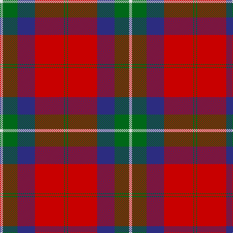

The parent of this is [Ruthven Clan Tartan Tartan Number: 1521. Earliest known date: 1842 The name Ruthven comes from the old Barony of Ruthven in Angus. Ruthvens were Earls of Gowrie at the time of James VI of Scotland. More recently Sir Alexander Hore- Ruthven of Freeland, Governor General of Australia, was created Earl of Gowrie in 1945. The Ruthven tartan was not named until the publication of the romantic fiction known as the Vestiarium Scoticum in 1842. See products available Copyright © Blair Urquhart, Comrie, 2015](/tartans/ln/6/g30/db36/r60/g2/r/4/)

This was sourced from house-of-tartan.  It is a [6 stripes tartan](/stripes/stripes6/).

Original link http://www.house-of-tartan.scotland.net/house/TartanViewjs.asp?colr=Def&tnam=1521

## Thread count
LN/6 G30 DB36 R60 G2 R/4

## Palette
Each colour and its ΔE from the base-6 reference it is a variant of.

| Colour | Shade | Base | ΔE (OKLab) |
|---|---|---|---|
| DB |  `#2C2C80` | B  | 0.05 |
| G |  `#006818` | G  | 0.02 |
| LN |  `#E0E0E0` | W  | 0.06 |
| R |  `#C80000` | R  | 0.00 |

# Sample pattern

ID: /variants/ln/6/g30/db36/r60/g2/r/4-db2c2c80-g006818-lne0e0e0-rc80000/
