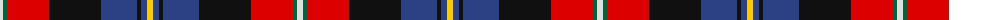

The parent of this is [Loch Etive](/tartans/ln/6/g4/r42/k52/b36/k4/b6/y/6/)

This was sourced from register-of-tartans.  It is a [8 stripes tartan](/stripes/stripes8/).

Original link https://www.tartanregister.gov.uk/tartanDetails.aspx?ref=11056

## Thread count
LN/6 G4 R42 K52 B36 K4 B6 Y/6

## Palette
Each colour and its ΔE from the base-6 reference it is a variant of.

| Colour | Shade | Base | ΔE (OKLab) |
|---|---|---|---|
| B |  `#2C4084` | B  | 0.00 |
| G |  `#00643C` | G  | 0.06 |
| K |  `#101010` | K  | 0.17 |
| LN |  `#E0E0E0` | W  | 0.06 |
| R |  `#DC0000` | R  | 0.04 |
| Y |  `#FCCC00` | Y  | 0.04 |

# Sample pattern

ID: /variants/ln/6/g4/r42/k52/b36/k4/b6/y/6-b2c4084-g00643c-k101010-lne0e0e0-rdc0000-yfccc00/
