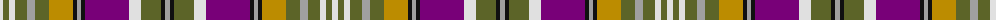

The parent of this is [Wexford County Crest (Fashion)](/tartans/ln/6/g6/ln6/g12/n8/g14/dy24/k4/n4/k4/p44/ln12/g20/k4/n/5/)

This was sourced from tartans-authority.  It is a [15 stripes tartan](/stripes/stripes15/).

Original link http://www.tartansauthority.com/tartan-ferret/display/7435/

## Thread count
LN/6 G6 LN6 G12 N8 G14 DY24 K4 N4 K4 P44 LN12 G20 K4 N/5

## Palette
Each colour and its ΔE from the base-6 reference it is a variant of.

| Colour | Shade | Base | ΔE (OKLab) |
|---|---|---|---|
| DY |  `#BC8C00` | Y  | 0.16 |
| G |  `#5C6428` | G  | 0.09 |
| K |  `#101010` | K  | 0.17 |
| LN |  `#E0E0E0` | W  | 0.06 |
| N |  `#A0A0A0` | Y  | 0.20 |
| P |  `#780078` | B  | 0.16 |

ID: /variants/ln/6/g6/ln6/g12/n8/g14/dy24/k4/n4/k4/p44/ln12/g20/k4/n/5-dybc8c00-g5c6428-k101010-lne0e0e0-na0a0a0-p780078/
