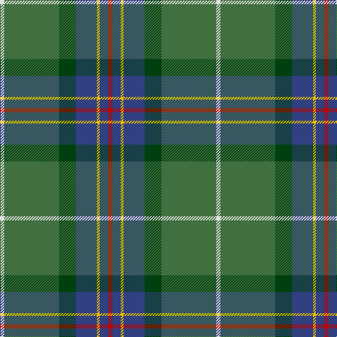

The parent of this is [Wagland](/tartans/ln/6/g78/dg24/b30/y4/b12/r/6/)

This was sourced from weddslist.  It is a [7 stripes tartan](/stripes/stripes7/).

Original link http://www.weddslist.com/cgi-bin/tartans/pg.pl?source=sts

## Thread count
LN/6 G78 DG24 B30 Y4 B12 R/6

## Palette
Each colour and its ΔE from the base-6 reference it is a variant of.

| Colour | Shade | Base | ΔE (OKLab) |
|---|---|---|---|
| B |  `#304080` | B  | 0.01 |
| DG |  `#004010` | G  | 0.12 |
| G |  `#407040` | G  | 0.08 |
| LN |  `#E0E0E0` | W  | 0.06 |
| R |  `#C00000` | R  | 0.02 |
| Y |  `#F0C000` | Y  | 0.01 |

# Sample pattern

ID: /variants/ln/6/g78/dg24/b30/y4/b12/r/6-b304080-dg004010-g407040-lne0e0e0-rc00000-yf0c000/
