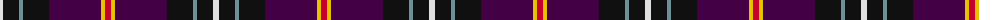
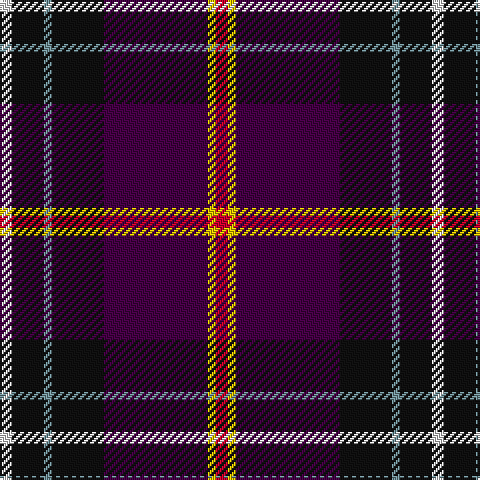

The parent of this is [Curnow of Kernow (Personal)](/tartans/ln/6/k16/lg4/k26/dp52/y4/r/6/)

This was sourced from tartans-authority.  It is a [7 stripes tartan](/stripes/stripes7/).

Original link http://www.tartansauthority.com/tartan-ferret/display/4084/

## Thread count
LN/6 K16 LG4 K26 DP52 Y4 R/6

## Palette
Each colour and its ΔE from the base-6 reference it is a variant of.

| Colour | Shade | Base | ΔE (OKLab) |
|---|---|---|---|
| DP |  `#440044` | B  | 0.17 |
| K |  `#101010` | K  | 0.17 |
| LG |  `#709098` | G  | 0.24 |
| LN |  `#E0E0E0` | W  | 0.06 |
| R |  `#C8002C` | R  | 0.03 |
| Y |  `#E8C000` | Y  | 0.00 |

# Sample pattern

ID: /variants/ln/6/k16/lg4/k26/dp52/y4/r/6-dp440044-k101010-lg709098-lne0e0e0-rc8002c-ye8c000/
