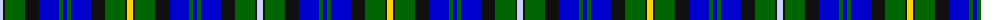

The parent of this is [Doon Valley Crafters](/tartans/ln/6/k2/g20/k14/b20/g4/b4/g4/b20/k14/g20/k2/y/6/)

This was sourced from register-of-tartans.  It is a [13 stripes tartan](/stripes/stripes13/).

Original link https://www.tartanregister.gov.uk/tartanDetails.aspx?ref=10806

## Thread count
LN/6 K2 G20 K14 B20 G4 B4 G4 B20 K14 G20 K2 Y/6

## Palette
Each colour and its ΔE from the base-6 reference it is a variant of.

| Colour | Shade | Base | ΔE (OKLab) |
|---|---|---|---|
| B |  `#0000CD` | B  | 0.15 |
| G |  `#006400` | G  | 0.00 |
| K |  `#101010` | K  | 0.17 |
| LN |  `#C8D3FA` | W  | 0.11 |
| Y |  `#FFD200` | Y  | 0.06 |

ID: /variants/ln/6/k2/g20/k14/b20/g4/b4/g4/b20/k14/g20/k2/y/6-b0000cd-g006400-k101010-lnc8d3fa-yffd200/
