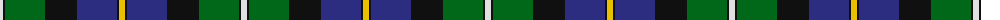
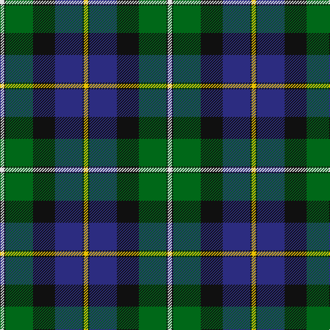

The parent of this is [MacCormick Tartan Tartan Number: 7161. Earliest known date: August 2007 Designed by Keith McCormick of New Brunswick, Canada for the use of his family which is descended from Hebridean Scots who were a sept of MacLaine of Lochbuie. Can be worn by those of the same name or spelling variations. See products available Copyright © Blair Urquhart, Comrie, 2015](/tartans/ln/6/k2/g40/k32/db40/k2/y/6/)

This was sourced from house-of-tartan.  It is a [7 stripes tartan](/stripes/stripes7/).

Original link http://www.house-of-tartan.scotland.net/house/TartanViewjs.asp?colr=Def&tnam=7161

## Thread count
LN/6 K2 G40 K32 DB40 K2 Y/6

## Palette
Each colour and its ΔE from the base-6 reference it is a variant of.

| Colour | Shade | Base | ΔE (OKLab) |
|---|---|---|---|
| DB |  `#2C2C80` | B  | 0.05 |
| G |  `#006818` | G  | 0.02 |
| K |  `#101010` | K  | 0.17 |
| LN |  `#E0E0E0` | W  | 0.06 |
| Y |  `#E8C000` | Y  | 0.00 |

# Sample pattern

ID: /variants/ln/6/k2/g40/k32/db40/k2/y/6-db2c2c80-g006818-k101010-lne0e0e0-ye8c000/
