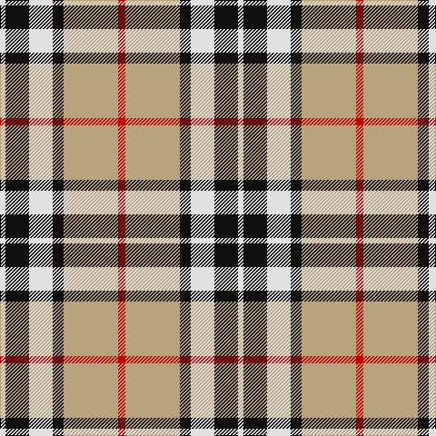

The parent of this is [Thomson, Camel (Fashion)](/tartans/ln/6/k26/ln26/k12/lg60/r/8/)

This was sourced from tartans-authority.  It is a [6 stripes tartan](/stripes/stripes6/).

Original link http://www.tartansauthority.com/tartan-ferret/display/2421/

## Thread count
LN/6 K26 LN26 K12 LG60 R/8

## Palette
Each colour and its ΔE from the base-6 reference it is a variant of.

| Colour | Shade | Base | ΔE (OKLab) |
|---|---|---|---|
| K |  `#101010` | K  | 0.17 |
| LG |  `#B8A47C` | Y  | 0.14 |
| LN |  `#E0E0E0` | W  | 0.06 |
| R |  `#C80000` | R  | 0.00 |

# Sample pattern

ID: /variants/ln/6/k26/ln26/k12/lg60/r/8-k101010-lgb8a47c-lne0e0e0-rc80000/
