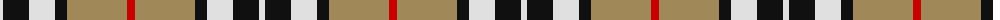
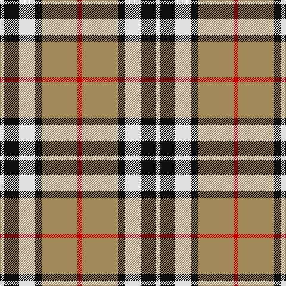

The parent of this is [Thomson Camel](/tartans/ln/6/k26/ln26/k12/lt60/r/8/)

This was sourced from register-of-tartans.  It is a [6 stripes tartan](/stripes/stripes6/).

Original link https://www.tartanregister.gov.uk/tartanDetails.aspx?ref=4121

## Thread count
LN/6 K26 LN26 K12 LT60 R/8

## Palette
Each colour and its ΔE from the base-6 reference it is a variant of.

| Colour | Shade | Base | ΔE (OKLab) |
|---|---|---|---|
| K |  `#101010` | K  | 0.17 |
| LN |  `#E0E0E0` | W  | 0.06 |
| LT |  `#A08858` | Y  | 0.21 |
| R |  `#C80000` | R  | 0.00 |

# Sample pattern

ID: /variants/ln/6/k26/ln26/k12/lt60/r/8-k101010-lne0e0e0-lta08858-rc80000/
