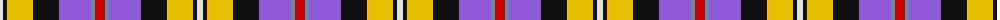
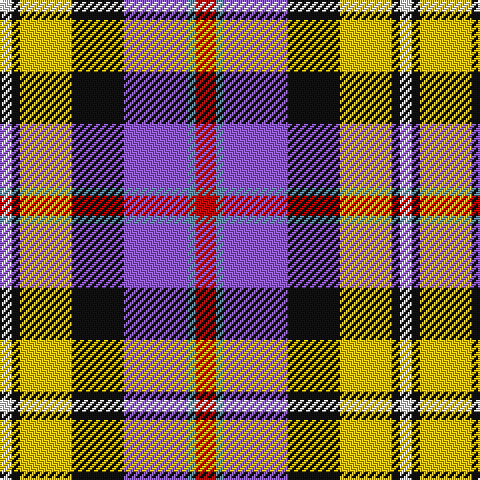

The parent of this is [Casey (Personal)](/tartans/ln/6/k4/y26/k26/p32/b4/r/10/)

This was sourced from tartans-authority.  It is a [7 stripes tartan](/stripes/stripes7/).

Original link http://www.tartansauthority.com/tartan-ferret/display/6914/

## Thread count
LN/6 K4 Y26 K26 P32 B4 R/10

## Palette
Each colour and its ΔE from the base-6 reference it is a variant of.

| Colour | Shade | Base | ΔE (OKLab) |
|---|---|---|---|
| B |  `#5C8CA8` | B  | 0.23 |
| K |  `#101010` | K  | 0.17 |
| LN |  `#E0E0E0` | W  | 0.06 |
| P |  `#9058D8` | B  | 0.22 |
| R |  `#C80000` | R  | 0.00 |
| Y |  `#E8C000` | Y  | 0.00 |

# Sample pattern

ID: /variants/ln/6/k4/y26/k26/p32/b4/r/10-b5c8ca8-k101010-lne0e0e0-p9058d8-rc80000-ye8c000/
