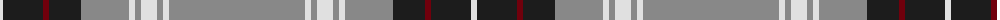

The parent of this is [Ben Vorlich (Fashion)](/tartans/ln/6/k40/dr6/k32/n48/ln6/na6/ln16/na6/ln6/na/136/)

This was sourced from tartans-authority.  It is a [11 stripes tartan](/stripes/stripes11/).

Original link http://www.tartansauthority.com/tartan-ferret/display/3678/

## Thread count
LN/6 K40 DR6 K32 N48 LN6 Na6 LN16 Na6 LN6 Na/136

## Palette
Each colour and its ΔE from the base-6 reference it is a variant of.

| Colour | Shade | Base | ΔE (OKLab) |
|---|---|---|---|
| DR |  `#70000C` | R  | 0.20 |
| K |  `#1C1C1C` | B  | 0.20 |
| LN |  `#E0E0E0` | W  | 0.06 |
| N |  `#888888` | R  | 0.24 |
| Na |  `#888888` | R  | 0.24 |

ID: /variants/ln/6/k40/dr6/k32/n48/ln6/na6/ln16/na6/ln6/na/136-dr70000c-k1c1c1c-lne0e0e0-n888888-na888888/
