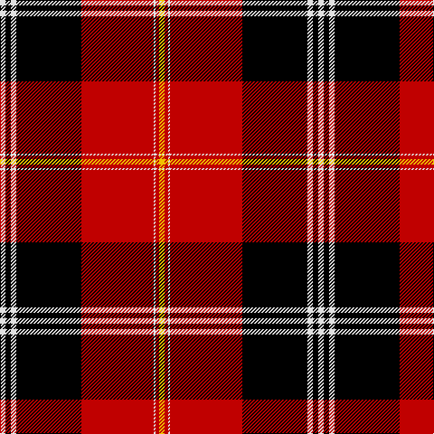

The parent of this is [Marjoribanks](/tartans/ln/6/k6/ln6/k72/r80/ln2/r4/y/6/)

This was sourced from weddslist.  It is a [8 stripes tartan](/stripes/stripes8/).

Original link http://www.weddslist.com/cgi-bin/tartans/pg.pl?source=sts

## Thread count
LN/6 K6 LN6 K72 R80 LN2 R4 Y/6

## Palette
Each colour and its ΔE from the base-6 reference it is a variant of.

| Colour | Shade | Base | ΔE (OKLab) |
|---|---|---|---|
| K |  `#000000` | K  | 0.00 |
| LN |  `#E0E0E0` | W  | 0.06 |
| R |  `#C00000` | R  | 0.02 |
| Y |  `#F0C000` | Y  | 0.01 |

# Sample pattern

ID: /variants/ln/6/k6/ln6/k72/r80/ln2/r4/y/6-k000000-lne0e0e0-rc00000-yf0c000/
