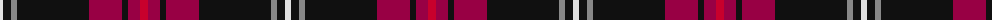

The parent of this is [Sreijsener (Name)](/tartans/ln/6/k8/n6/k72/r33/k6/r12/ra/8/)

This was sourced from tartans-authority.  It is a [8 stripes tartan](/stripes/stripes8/).

Original link http://www.tartansauthority.com/tartan-ferret/display/8272/

## Thread count
LN/6 K8 N6 K72 R33 K6 R12 Ra/8

## Palette
Each colour and its ΔE from the base-6 reference it is a variant of.

| Colour | Shade | Base | ΔE (OKLab) |
|---|---|---|---|
| K |  `#101010` | K  | 0.17 |
| LN |  `#E0E0E0` | W  | 0.06 |
| N |  `#888888` | R  | 0.24 |
| R |  `#980044` | R  | 0.12 |
| Ra |  `#C8002C` | R  | 0.03 |

# Sample pattern

ID: /variants/ln/6/k8/n6/k72/r33/k6/r12/ra/8-k101010-lne0e0e0-n888888-r980044-rac8002c/
