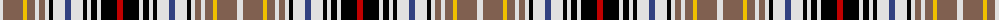

The parent of this is [Clanedin](/tartans/ln/6/lt20/y4/lt8/ln4/lt6/ln4/k4/ln12/b6/ln12/k4/ln4/k6/ln4/k16/r/6/)

This was sourced from weddslist.  It is a [17 stripes tartan](/stripes/stripes17/).

Original link http://www.weddslist.com/cgi-bin/tartans/pg.pl?source=sts

## Thread count
LN/6 LT20 Y4 LT8 LN4 LT6 LN4 K4 LN12 B6 LN12 K4 LN4 K6 LN4 K16 R/6

## Palette
Each colour and its ΔE from the base-6 reference it is a variant of.

| Colour | Shade | Base | ΔE (OKLab) |
|---|---|---|---|
| B |  `#304080` | B  | 0.01 |
| K |  `#000000` | K  | 0.00 |
| LN |  `#E0E0E0` | W  | 0.06 |
| LT |  `#806050` | R  | 0.17 |
| R |  `#C00000` | R  | 0.02 |
| Y |  `#F0C000` | Y  | 0.01 |

ID: /variants/ln/6/lt20/y4/lt8/ln4/lt6/ln4/k4/ln12/b6/ln12/k4/ln4/k6/ln4/k16/r/6-b304080-k000000-lne0e0e0-lt806050-rc00000-yf0c000/
