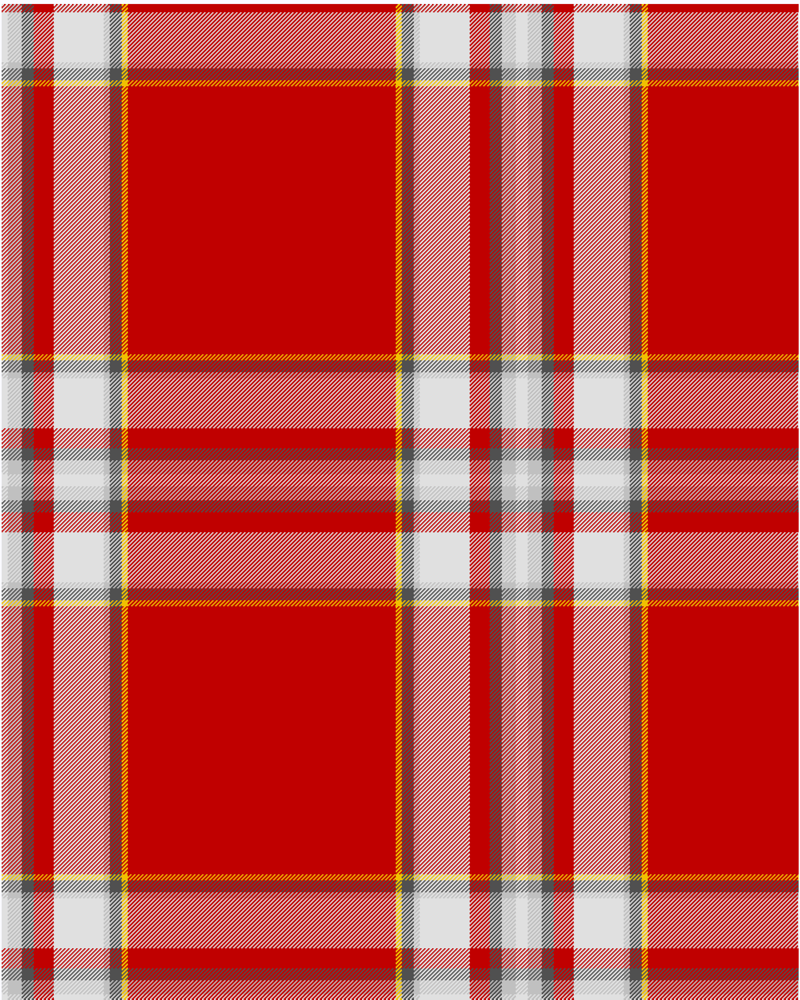

The parent of this is [Drummond of Perth, dress](/tartans/ln/6/n14/na12/r20/ln50/n6/na12/y6/r/134/)

This was sourced from <no value>.  It is a [9 stripes tartan](/stripes/stripes9/).

Original link http://www.weddslist.com/cgi-bin/tartans/pg.pl?source=sts

## Thread count
LN/6 N14 NA12 R20 LN50 N6 NA12 Y6 R/134

## Palette
LN N NA R Y

# Sample pattern

ID: /variants/ln/6/n14/na12/r20/ln50/n6/na12/y6/r/134-lne0e0e0-nc0c0c0-na505050-rc00000-yf0c000/