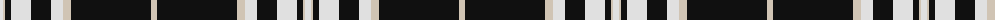

The parent of this is [Moonlight Glen (Fashion)](/tartans/ln/6/n2/k6/ln20/k20/ln12/n8/k80/n/6/)

This was sourced from tartans-authority.  It is a [9 stripes tartan](/stripes/stripes9/).

Original link http://www.tartansauthority.com/tartan-ferret/display/7611/

## Thread count
LN/6 N2 K6 LN20 K20 LN12 N8 K80 N/6

## Palette
Each colour and its ΔE from the base-6 reference it is a variant of.

| Colour | Shade | Base | ΔE (OKLab) |
|---|---|---|---|
| K |  `#101010` | K  | 0.17 |
| LN |  `#E0E0E0` | W  | 0.06 |
| N |  `#D0C4B4` | W  | 0.14 |

ID: /variants/ln/6/n2/k6/ln20/k20/ln12/n8/k80/n/6-k101010-lne0e0e0-nd0c4b4/
