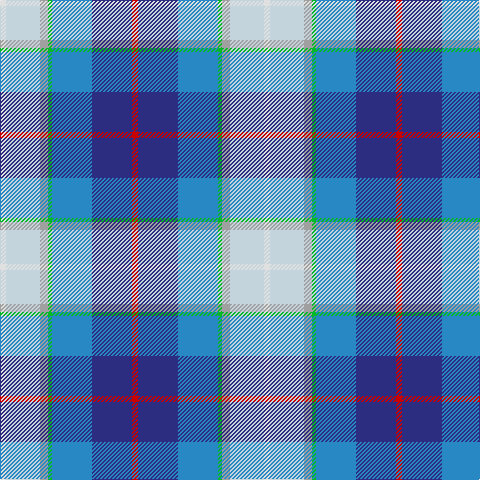

The parent of this is [Silversea (Corporate)](/tartans/ln/6/n34/na8/g4/b40/db40/r/6/)

This was sourced from tartans-authority.  It is a [7 stripes tartan](/stripes/stripes7/).

Original link http://www.tartansauthority.com/tartan-ferret/display/10261/

## Thread count
LN/6 N34 Na8 G4 B40 DB40 R/6

## Palette
Each colour and its ΔE from the base-6 reference it is a variant of.

| Colour | Shade | Base | ΔE (OKLab) |
|---|---|---|---|
| B |  `#2888C4` | B  | 0.21 |
| DB |  `#2C2C80` | B  | 0.05 |
| G |  `#00B828` | Y  | 0.22 |
| LN |  `#E0E0E0` | W  | 0.06 |
| N |  `#C4D4DC` | W  | 0.11 |
| Na |  `#A0A0A0` | Y  | 0.20 |
| R |  `#C80000` | R  | 0.00 |

# Sample pattern

ID: /variants/ln/6/n34/na8/g4/b40/db40/r/6-b2888c4-db2c2c80-g00b828-lne0e0e0-nc4d4dc-naa0a0a0-rc80000/
