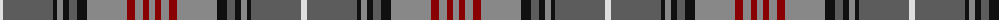

The parent of this is [MacLellan of Gartbreck (Personal)](/tartans/ln/6/n50/k4/na6/k6/n8/k10/na40/dr8/na8/dr6/na/6/)

This was sourced from tartans-authority.  It is a [12 stripes tartan](/stripes/stripes12/).

Original link http://www.tartansauthority.com/tartan-ferret/display/7426/

## Thread count
LN/6 N50 K4 Na6 K6 N8 K10 Na40 DR8 Na8 DR6 Na/6

## Palette
Each colour and its ΔE from the base-6 reference it is a variant of.

| Colour | Shade | Base | ΔE (OKLab) |
|---|---|---|---|
| DR |  `#880000` | R  | 0.14 |
| K |  `#101010` | K  | 0.17 |
| LN |  `#E0E0E0` | W  | 0.06 |
| N |  `#5C5C5C` | B  | 0.14 |
| Na |  `#888888` | R  | 0.24 |

ID: /variants/ln/6/n50/k4/na6/k6/n8/k10/na40/dr8/na8/dr6/na/6-dr880000-k101010-lne0e0e0-n5c5c5c-na888888/
