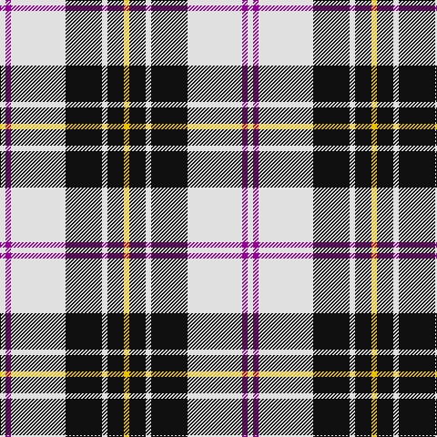

The parent of this is [MacPherson Dress (1951)](/tartans/ln/6/p6/ln60/k40/ln6/k18/y/6/)

This was sourced from tartans-authority.  It is a [7 stripes tartan](/stripes/stripes7/).

Original link http://www.tartansauthority.com/tartan-ferret/display/5921/

## Thread count
LN/6 P6 LN60 K40 LN6 K18 Y/6

## Palette
Each colour and its ΔE from the base-6 reference it is a variant of.

| Colour | Shade | Base | ΔE (OKLab) |
|---|---|---|---|
| K |  `#101010` | K  | 0.17 |
| LN |  `#E0E0E0` | W  | 0.06 |
| P |  `#940094` | B  | 0.20 |
| Y |  `#E8C000` | Y  | 0.00 |

# Sample pattern

ID: /variants/ln/6/p6/ln60/k40/ln6/k18/y/6-k101010-lne0e0e0-p940094-ye8c000/
