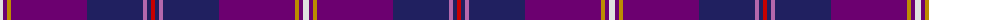

The parent of this is [Gretna Gold (Fashion)](/tartans/ln/6/pa4/dy4/pa76/db56/p4/db4/r/4/)

This was sourced from tartans-authority.  It is a [8 stripes tartan](/stripes/stripes8/).

Original link http://www.tartansauthority.com/tartan-ferret/display/6032/

## Thread count
LN/6 Pa4 DY4 Pa76 DB56 P4 DB4 R/4

## Palette
Each colour and its ΔE from the base-6 reference it is a variant of.

| Colour | Shade | Base | ΔE (OKLab) |
|---|---|---|---|
| DB |  `#202060` | B  | 0.11 |
| DY |  `#BC8C00` | Y  | 0.16 |
| LN |  `#E0E0E0` | W  | 0.06 |
| P |  `#B468AC` | R  | 0.21 |
| Pa |  `#6C0070` | B  | 0.15 |
| R |  `#C80000` | R  | 0.00 |

# Sample pattern

ID: /variants/ln/6/pa4/dy4/pa76/db56/p4/db4/r/4-db202060-dybc8c00-lne0e0e0-pb468ac-pa6c0070-rc80000/
