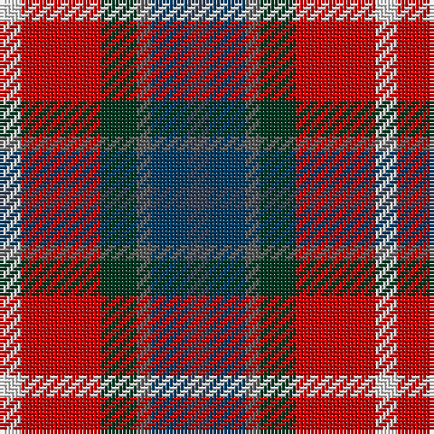

The parent of this is [Nicolson of Lewis (Clan?)](/tartans/ln/6/r22/dg10/n4/db10/na/6/)

This was sourced from tartans-authority.  It is a [6 stripes tartan](/stripes/stripes6/).

Original link http://www.tartansauthority.com/tartan-ferret/display/7810/

## Thread count
LN/6 R22 DG10 N4 DB10 Na/6

## Palette
Each colour and its ΔE from the base-6 reference it is a variant of.

| Colour | Shade | Base | ΔE (OKLab) |
|---|---|---|---|
| DB |  `#003C64` | B  | 0.07 |
| DG |  `#003820` | G  | 0.16 |
| LN |  `#E0E0E0` | W  | 0.06 |
| N |  `#5C5C5C` | B  | 0.14 |
| Na |  `#344054` | B  | 0.08 |
| R |  `#C80000` | R  | 0.00 |

# Sample pattern

ID: /variants/ln/6/r22/dg10/n4/db10/na/6-db003c64-dg003820-lne0e0e0-n5c5c5c-na344054-rc80000/
