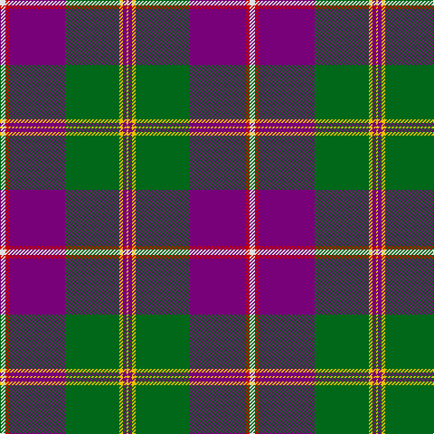

The parent of this is [Caig (Corporate)](/tartans/ln/6/r4/p62/g60/y4/p4/y/2/)

This was sourced from tartans-authority.  It is a [7 stripes tartan](/stripes/stripes7/).

Original link http://www.tartansauthority.com/tartan-ferret/display/7352/

## Thread count
LN/6 R4 P62 G60 Y4 P4 Y/2

## Palette
Each colour and its ΔE from the base-6 reference it is a variant of.

| Colour | Shade | Base | ΔE (OKLab) |
|---|---|---|---|
| G |  `#006818` | G  | 0.02 |
| LN |  `#E0E0E0` | W  | 0.06 |
| P |  `#780078` | B  | 0.16 |
| R |  `#C80000` | R  | 0.00 |
| Y |  `#E8C000` | Y  | 0.00 |

# Sample pattern

ID: /variants/ln/6/r4/p62/g60/y4/p4/y/2-g006818-lne0e0e0-p780078-rc80000-ye8c000/
