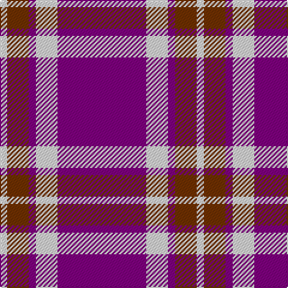

The parent of this is [Glen App](/tartans/ln/6/t18/p6/ln18/p/74/)

This was sourced from weddslist.  It is a [5 stripes tartan](/stripes/stripes5/).

Original link http://www.weddslist.com/cgi-bin/tartans/pg.pl?source=sts

## Thread count
LN/6 T18 P6 LN18 P/74

## Palette
Each colour and its ΔE from the base-6 reference it is a variant of.

| Colour | Shade | Base | ΔE (OKLab) |
|---|---|---|---|
| LN |  `#E0E0E0` | W  | 0.06 |
| P |  `#800080` | B  | 0.17 |
| T |  `#703000` | R  | 0.18 |

# Sample pattern

ID: /variants/ln/6/t18/p6/ln18/p/74-lne0e0e0-p800080-t703000/
