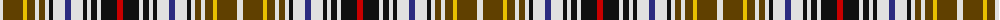

The parent of this is [Clanedin Commemorative Tartan Tartan Number: 1619. Earliest known date: 1970 Commonwealth Games 1970 See products available Copyright © Blair Urquhart, Comrie, 2015](/tartans/ln/6/t20/y4/t8/ln4/t6/ln4/k4/ln12/db6/ln12/k4/ln4/k6/ln4/k16/r/6/)

This was sourced from house-of-tartan.  It is a [17 stripes tartan](/stripes/stripes17/).

Original link http://www.house-of-tartan.scotland.net/house/TartanViewjs.asp?colr=Def&tnam=1619

## Thread count
LN/6 T20 Y4 T8 LN4 T6 LN4 K4 LN12 DB6 LN12 K4 LN4 K6 LN4 K16 R/6

## Palette
Each colour and its ΔE from the base-6 reference it is a variant of.

| Colour | Shade | Base | ΔE (OKLab) |
|---|---|---|---|
| DB |  `#2C2C80` | B  | 0.05 |
| K |  `#101010` | K  | 0.17 |
| LN |  `#E0E0E0` | W  | 0.06 |
| R |  `#C80000` | R  | 0.00 |
| T |  `#604000` | G  | 0.14 |
| Y |  `#E8C000` | Y  | 0.00 |

ID: /variants/ln/6/t20/y4/t8/ln4/t6/ln4/k4/ln12/db6/ln12/k4/ln4/k6/ln4/k16/r/6-db2c2c80-k101010-lne0e0e0-rc80000-t604000-ye8c000/
