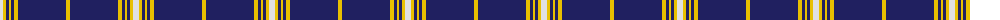
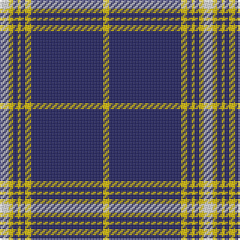

The parent of this is [Morris Welsh Name Tartan Tartan Number: 5749. Earliest known date: 2002 The tartan for this Welsh surname and its variations, Meyrick, Meurig, is actually woven in Wales at the Cambrian Woollen Mill, weaving on the same site since 1830. This tartan differs from many traditional patterns in that the warp and weft differ, giving the finished worsted wool cloth more of a predominant stripe, vertically noticeable in the finished Kilt, or Cilt in Wales. See products available Copyright © Blair Urquhart, Comrie, 2015](/tartans/ln/6/y3/db3/y2/db3/y4/db48/y/4/)

This was sourced from house-of-tartan.  It is a [8 stripes tartan](/stripes/stripes8/).

Original link http://www.house-of-tartan.scotland.net/house/TartanViewjs.asp?colr=Def&tnam=5749

## Thread count
LN/6 Y3 DB3 Y2 DB3 Y4 DB48 Y/4

## Palette
Each colour and its ΔE from the base-6 reference it is a variant of.

| Colour | Shade | Base | ΔE (OKLab) |
|---|---|---|---|
| DB |  `#202060` | B  | 0.11 |
| LN |  `#E0E0E0` | W  | 0.06 |
| Y |  `#E8C000` | Y  | 0.00 |

# Sample pattern

ID: /variants/ln/6/y3/db3/y2/db3/y4/db48/y/4-db202060-lne0e0e0-ye8c000/
