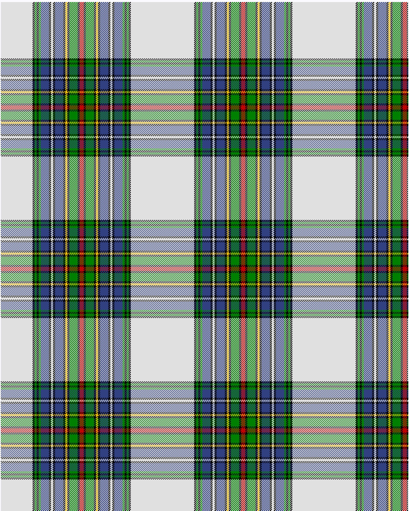

Cockburn of Ormiston, dress

This was sourced from <no value>.  It is a 16 stripes tartan.

Original link http://www.weddslist.com/cgi-bin/tartans/pg.pl?source=sts

## Thread count
LN/62 K4 G4 K4 G4 B16 K4 LN4 K4 B16 K4 Y4 K4 G16 K4 R/4

## Palette
B#304080 G#008000 K#000000 LN#E0E0E0 R#C00000 Y#F0C000

# Sample pattern

ID: /variants/ln/62/k4/g4/k4/g4/b16/k4/ln4/k4/b16/k4/y4/k4/g16/k4/r/4-b304080-g008000-k000000-lne0e0e0-rc00000-yf0c000