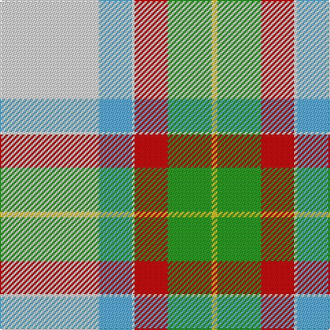

The parent of this is [MacNappy](/tartans/ln/72/b24/ln2/r24/g32/y/4/)

This was sourced from tartans-authority.  It is a [6 stripes tartan](/stripes/stripes6/).

Original link http://www.tartansauthority.com/tartan-ferret/display/10081/

## Thread count
LN/72 B24 LN2 R24 G32 Y/4

## Palette
Each colour and its ΔE from the base-6 reference it is a variant of.

| Colour | Shade | Base | ΔE (OKLab) |
|---|---|---|---|
| B |  `#5CACDC` | W  | 0.28 |
| G |  `#289C18` | G  | 0.18 |
| LN |  `#E0E0E0` | W  | 0.06 |
| R |  `#C80000` | R  | 0.00 |
| Y |  `#E8C000` | Y  | 0.00 |

# Sample pattern

ID: /variants/ln/72/b24/ln2/r24/g32/y/4-b5cacdc-g289c18-lne0e0e0-rc80000-ye8c000/
