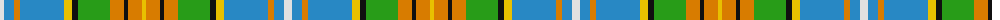

The parent of this is [Cossar (Personal)](/tartans/ln/8/b10/o6/b44/y8/k6/g32/o14/k4/o14/y/4/)

This was sourced from tartans-authority.  It is a [11 stripes tartan](/stripes/stripes11/).

Original link http://www.tartansauthority.com/tartan-ferret/display/3947/

## Thread count
LN/8 B10 O6 B44 Y8 K6 G32 O14 K4 O14 Y/4

## Palette
Each colour and its ΔE from the base-6 reference it is a variant of.

| Colour | Shade | Base | ΔE (OKLab) |
|---|---|---|---|
| B |  `#2888C4` | B  | 0.21 |
| G |  `#289C18` | G  | 0.18 |
| K |  `#101010` | K  | 0.17 |
| LN |  `#E0E0E0` | W  | 0.06 |
| O |  `#D87C00` | Y  | 0.17 |
| Y |  `#E8C000` | Y  | 0.00 |

ID: /variants/ln/8/b10/o6/b44/y8/k6/g32/o14/k4/o14/y/4-b2888c4-g289c18-k101010-lne0e0e0-od87c00-ye8c000/
