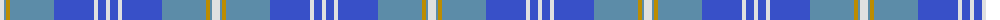

The parent of this is [Gorman Blue (Personal)](/tartans/ln/8/b2/dy4/b44/ba40/ln4/ba8/ln/4/)

This was sourced from tartans-authority.  It is a [8 stripes tartan](/stripes/stripes8/).

Original link http://www.tartansauthority.com/tartan-ferret/display/10390/

## Thread count
LN/8 B2 DY4 B44 Ba40 LN4 Ba8 LN/4

## Palette
Each colour and its ΔE from the base-6 reference it is a variant of.

| Colour | Shade | Base | ΔE (OKLab) |
|---|---|---|---|
| B |  `#5C8CA8` | B  | 0.23 |
| Ba |  `#3850C8` | B  | 0.12 |
| DY |  `#BC8C00` | Y  | 0.16 |
| LN |  `#E0E0E0` | W  | 0.06 |

# Sample pattern

ID: /variants/ln/8/b2/dy4/b44/ba40/ln4/ba8/ln/4-b5c8ca8-ba3850c8-dybc8c00-lne0e0e0/
