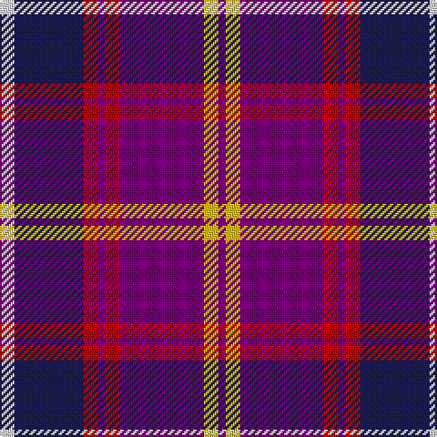

The parent of this is [Brigadoon (Fashion)](/tartans/ln/8/db38/r8/p4/r8/p46/y8/p/4/)

This was sourced from tartans-authority.  It is a [8 stripes tartan](/stripes/stripes8/).

Original link http://www.tartansauthority.com/tartan-ferret/display/7349/

## Thread count
LN/8 DB38 R8 P4 R8 P46 Y8 P/4

## Palette
Each colour and its ΔE from the base-6 reference it is a variant of.

| Colour | Shade | Base | ΔE (OKLab) |
|---|---|---|---|
| DB |  `#1C1C50` | B  | 0.14 |
| LN |  `#E0E0E0` | W  | 0.06 |
| P |  `#780078` | B  | 0.16 |
| R |  `#C80000` | R  | 0.00 |
| Y |  `#E8C000` | Y  | 0.00 |

# Sample pattern

ID: /variants/ln/8/db38/r8/p4/r8/p46/y8/p/4-db1c1c50-lne0e0e0-p780078-rc80000-ye8c000/
