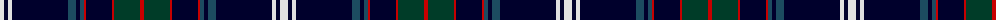

The parent of this is [Niagara Region (District)](/tartans/ln/8/db4/ln4/db56/dba8/db4/dba4/r2/db26/r2/dg26/r/4/)

This was sourced from tartans-authority.  It is a [12 stripes tartan](/stripes/stripes12/).

Original link http://www.tartansauthority.com/tartan-ferret/display/7110/

## Thread count
LN/8 DB4 LN4 DB56 DBa8 DB4 DBa4 R2 DB26 R2 DG26 R/4

## Palette
Each colour and its ΔE from the base-6 reference it is a variant of.

| Colour | Shade | Base | ΔE (OKLab) |
|---|---|---|---|
| DB |  `#00002C` | K  | 0.16 |
| DBa |  `#1C4C60` | B  | 0.08 |
| DG |  `#003C28` | G  | 0.15 |
| LN |  `#E0E0E0` | W  | 0.06 |
| R |  `#C80000` | R  | 0.00 |

ID: /variants/ln/8/db4/ln4/db56/dba8/db4/dba4/r2/db26/r2/dg26/r/4-db00002c-dba1c4c60-dg003c28-lne0e0e0-rc80000/
