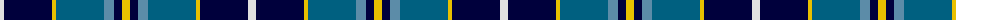

The parent of this is [Mina Perhonen (Corporate)](/tartans/ln/8/db48/y4/ba48/b10/db8/y/8/)

This was sourced from tartans-authority.  It is a [7 stripes tartan](/stripes/stripes7/).

Original link http://www.tartansauthority.com/tartan-ferret/display/5797/

## Thread count
LN/8 DB48 Y4 Ba48 B10 DB8 Y/8

## Palette
Each colour and its ΔE from the base-6 reference it is a variant of.

| Colour | Shade | Base | ΔE (OKLab) |
|---|---|---|---|
| B |  `#5C8CA8` | B  | 0.23 |
| Ba |  `#006080` | B  | 0.10 |
| DB |  `#00003C` | K  | 0.20 |
| LN |  `#E0E0E0` | W  | 0.06 |
| Y |  `#E8C000` | Y  | 0.00 |

# Sample pattern

ID: /variants/ln/8/db48/y4/ba48/b10/db8/y/8-b5c8ca8-ba006080-db00003c-lne0e0e0-ye8c000/
