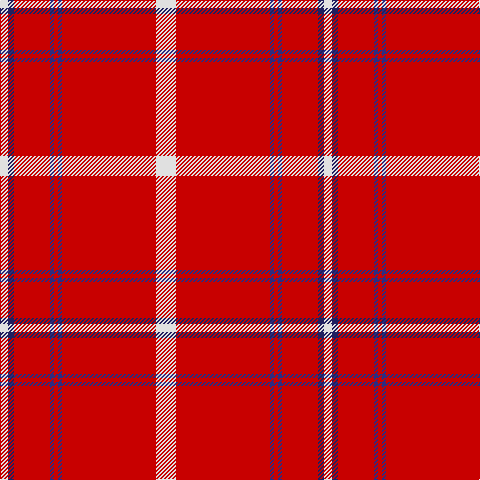

The parent of this is [Swiss National (Fashion)](/tartans/ln/8/dba6/r36/db4/r4/db4/r94/ln/20/)

This was sourced from tartans-authority.  It is a [8 stripes tartan](/stripes/stripes8/).

Original link http://www.tartansauthority.com/tartan-ferret/display/10491/

## Thread count
LN/8 DBa6 R36 DB4 R4 DB4 R94 LN/20

## Palette
Each colour and its ΔE from the base-6 reference it is a variant of.

| Colour | Shade | Base | ΔE (OKLab) |
|---|---|---|---|
| DB |  `#2C2C80` | B  | 0.05 |
| DBa |  `#202060` | B  | 0.11 |
| LN |  `#E0E0E0` | W  | 0.06 |
| R |  `#C80000` | R  | 0.00 |

# Sample pattern

ID: /variants/ln/8/dba6/r36/db4/r4/db4/r94/ln/20-db2c2c80-dba202060-lne0e0e0-rc80000/
